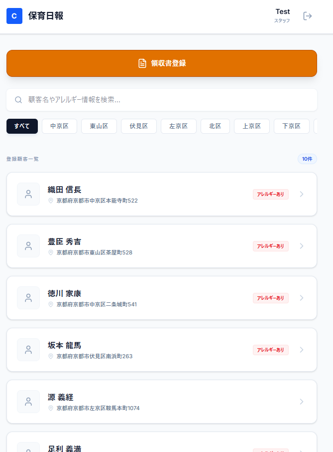

# 保育日報アプリ (Childcare Report App)

Gemini API と Firebase を使って、保育現場の日報作成、事故報告、顧客管理、領収書登録を行う Web アプリ。

## スクリーンショット



## 現在の主な機能

### 1. 顧客管理
- 顧客一覧表示、顧客名検索、地域フィルタ
- 顧客詳細表示
- 活動記録の一覧表示
- 初回起動時のサンプルデータ投入

### 2. TSV/CSV インポート（アップサート）
- 設定画面から TSV/CSV ファイルを取り込み
- `customers` と `customers/{id}/family` をアップサート
- 進捗表示（件数、割合、upsert/skipped）
- UTF-8/UTF-16、カンマ区切り/タブ区切りに対応
- 世帯情報の分解は GAS 実装に近いロジックを移植

### 3. 日報/事故報告の AI 支援
- Gemini による日報生成
- Gemini による事故報告の構造化
- 音声入力補助（ブラウザ音声認識）

### 4. 領収書登録
- 画像から領収書情報を抽出して登録

### 5. 設定管理と監査ログ
- Firestore `settings/app` でモデルやプロンプト設定を管理
- 主要操作の監査ログを Firestore に保存

## 技術スタック

- React 19 / TypeScript / Vite
- Firebase Auth / Firestore
- Firebase Emulator Suite
- Gemini API (`@google/genai`)
- Lucide React / Motion

## ローカル起動

### 前提
- Node.js インストール済み

### セットアップ

```bash
npm install
```

`.env` を作成し、Gemini API キーを設定。

```env
VITE_GEMINI_API_KEY=YOUR_GEMINI_API_KEY
```

### 起動（推奨）

```powershell
./start.ps1
```

`start.ps1` の実行内容:
- 依存関係チェック
- Emulator ポート競合の解消
- Firestore/Auth Emulator 起動（別ターミナル）
- Vite 起動
- `npm run dev` 終了時のエミュレータデータ自動保存

### 保存を手動実行する場合

```powershell
./save-emulator-data.ps1
```

## 開発時URL

- アプリ: http://localhost:3000
- Emulator UI: http://localhost:4000/firestore

## Firebase移行

新規 Firebase プロジェクトへの移行手順は以下を参照。

- `docs/firebase-new-project-migration.md`

## 補足

- 開発時の Firestore 接続はエミュレータ永続化優先のため default DB を使用
- 本番時は `firebase-applet-config.json` の `firestoreDatabaseId` を使用